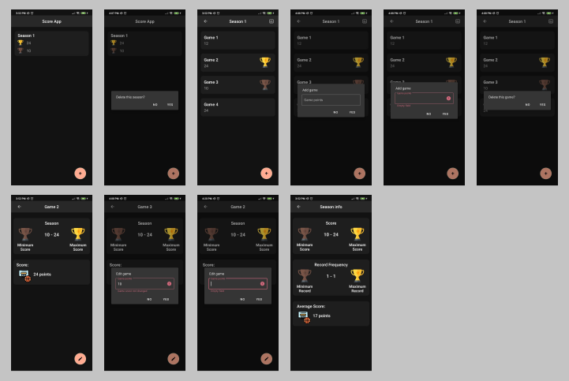
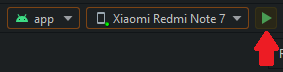
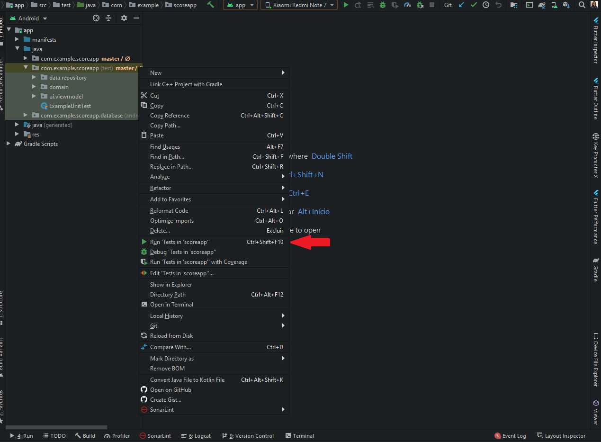
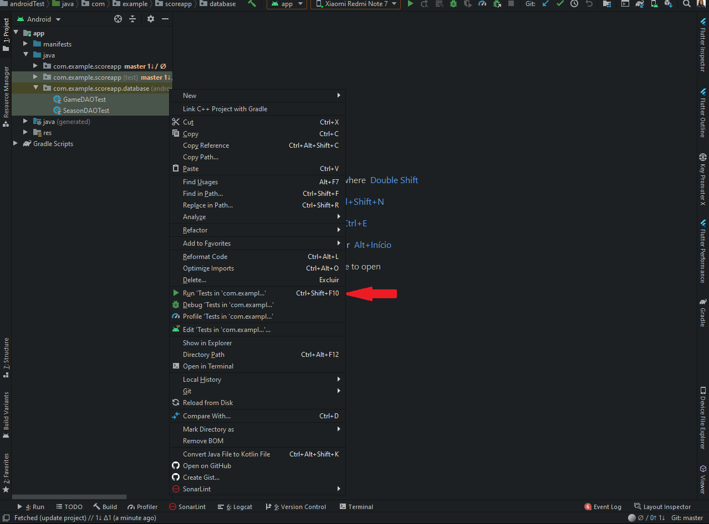

# Score App

## About this project

A Android App for register basketball seasons and games.

## User functionalities

- Display information based on games of a season.

- Seasons
    - Register and delete seasons.

- Games 
    - Register, delete and edit games.

## Installers

If you want to test the app in the production mode, here is the [Android apk](https://drive.google.com/file/d/1egSMERLWVTsHyOoqRIfRJjJco1ZpAK21/view?usp=sharing).

## Getting Started

### Prerequisites

To run this project in the development mode, you'll need to have a basic environment to run a Android App, that can be found [here](https://developer.android.com/studio).
After that you can run the app in an Android Emulator, [here is a guide for configure it](https://developer.android.com/studio/run/emulator#install), or with a physical device with developer mode on, [here is a guide for it](https://developer.android.com/studio/debug/dev-options).

### Running

Click in this button. 

### Running Tests

No device requiered.

### Running Database Tests

These tests need a physcal device/emulator to run.

